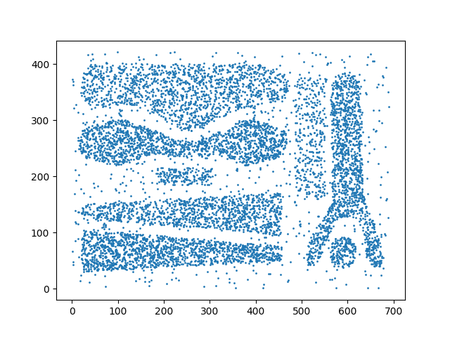
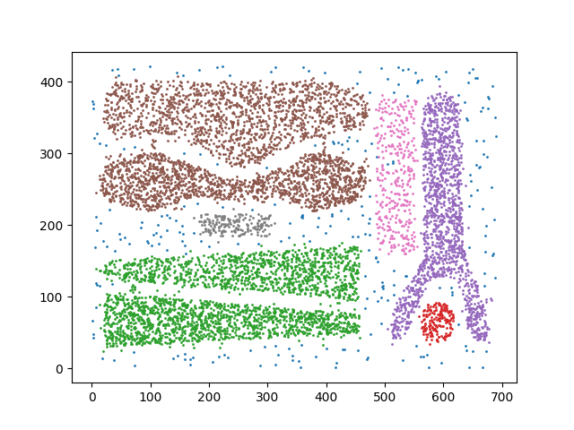

# DBSCAN

In this program i have implemented the Density-Based Spatial Clustering of Application with Noise Algorithm in c++ whose detail can be found on [wikipedia page](https://en.wikipedia.org/wiki/DBSCAN). my range query function is not optimized and takes O(n) time. you can find many similarities between the pseudo code and [my implementation](DBSCAN.cpp) of the alogrithm.

the program also uses [matplotlibcpp](https://matplotlib-cpp.readthedocs.io/en/latest/) to plot the data set and the clusters found using the popular plotting library, matplotlib, from python. thus the program requires a working installation of python with matplotlib module installed and should be properly linked and should include the header files path for the same in the makefile.
   

    
   

